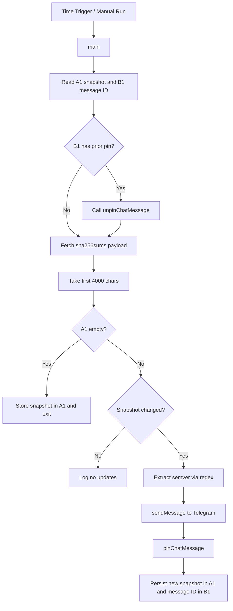

## 1. Title and Description

# GAP Factorio Update Bot Logger

A lightweight Google Apps Script logging utility for release monitoring that detects Factorio build changes and publishes pinned Telegram notifications with persistent state tracking.

[](#7-deployment)
[](#1-title-and-description)
[](LICENSE)
[](#4-tech-stack--architecture)

> [!NOTE]
> This README is based on the current repository implementation (`main.gs` and `mainSPREADSHEET_ID.gs`) and documents both active-spreadsheet and fixed-spreadsheet execution modes.

## 2. Table of Contents

- [1. Title and Description](#1-title-and-description)
- [2. Table of Contents](#2-table-of-contents)
- [3. Features](#3-features)
- [4. Tech Stack & Architecture](#4-tech-stack--architecture)
- [5. Getting Started](#5-getting-started)
- [6. Testing](#6-testing)
- [7. Deployment](#7-deployment)
- [8. Usage](#8-usage)
- [9. Configuration](#9-configuration)
- [10. License](#10-license)
- [11. Contacts & Community Support](#11-contacts--community-support)

## 3. Features

- Continuous remote checksum monitoring of `https://factorio.com/download/sha256sums/`.
- Release detection using persisted state snapshots in Google Sheets (`A1`).
- Telegram Bot API integration for automated release announcements.
- MarkdownV2-compatible rich notification formatting.
- Automatic pinning of the newly published message.
- Automatic unpinning of the previously pinned message using persisted message ID (`B1`).
- First-run bootstrap behavior to initialize state without spamming notifications.
- Two operational variants:
  - `main.gs`: works from currently active spreadsheet context.
  - `mainSPREADSHEET_ID.gs`: targets a fixed sheet via explicit `SPREADSHEET_ID`.
- Lightweight architecture relying only on native Apps Script services.
- Designed for trigger-safe stateless execution with externalized persistence.

> [!IMPORTANT]
> Credentials are placeholders in source (`TELEGRAM_TOKEN`, `CHAT_ID`, `SPREADSHEET_ID`) and must be replaced before production use.

> [!WARNING]
> Never commit real bot tokens to a public repository. Prefer Google Apps Script Properties or CI substitution where possible.

## 4. Tech Stack & Architecture

### Core Stack

- **Language:** JavaScript (Google Apps Script runtime dialect).
- **Runtime:** Google Apps Script execution environment.
- **State Layer:** Google Sheets (`SpreadsheetApp` service).
- **Remote Endpoints:**
  - Factorio release checksum page.
  - Telegram Bot API (`sendMessage`, `pinChatMessage`, `unpinChatMessage`).

### Project Structure

```text
.
├── LICENSE
├── README.md
├── main.gs
└── mainSPREADSHEET_ID.gs
```

### Key Design Decisions

- **Spreadsheet-backed state** was selected for simplicity, observability, and zero additional infrastructure.
- **Cycle-level unpin then publish** keeps a single authoritative pinned release in the destination chat.
- **Regex-based semantic extraction** isolates version parsing in `extractVersion(text)` and keeps message construction deterministic.
- **Content snapshot comparison** on a normalized substring (`0..4000`) provides low-overhead change detection.
- **Dual entry files** support both embedded spreadsheet execution and centralized sheet operation.

### Logging and Notification Pipeline



> [!TIP]
> If upstream artifact naming changes, update the regex in `extractVersion` immediately to prevent silent version parsing misses.

## 5. Getting Started

### Prerequisites

- A Google account with Apps Script access.
- A Telegram bot token created via `@BotFather`.
- A target Telegram chat/channel ID where the bot can post and pin messages.
- A Google Sheet for persistent state.
- Optional local tooling for source control sync:
  - Node.js `>=18`.
  - `@google/clasp`.

### Installation

```bash
git clone https://github.com/<your-org>/GAP_Facotrio-Update-bot.git
cd GAP_Facotrio-Update-bot
```

Optional `clasp` setup:

```bash
npm install -g @google/clasp
clasp login
clasp create --type standalone --title "GAP Factorio Update Bot"
clasp push
```

Manual setup in Apps Script editor:

1. Create a new standalone Apps Script project.
2. Copy either `main.gs` or `mainSPREADSHEET_ID.gs` into the editor.
3. Replace placeholders in constants.
4. Save and run `main` once to grant permissions.

## 6. Testing

This repository currently uses operational validation rather than a dedicated automated test framework.

Recommended commands:

```bash
node --check main.gs
node --check mainSPREADSHEET_ID.gs
```

Optional Apps Script sync verification:

```bash
clasp status
```

Manual integration checklist:

1. Set valid credentials and identifiers.
2. Reset state by clearing cells `A1` and `B1`.
3. Run `main` and verify first-run initialization behavior.
4. Force a difference by editing `A1`.
5. Run `main` again and validate message send, pin, and state update.

> [!CAUTION]
> Telegram API failures, permission errors, or missing pin rights can produce partial success states (message sent but not pinned). Validate bot permissions in the chat.

## 7. Deployment

### Production Rollout

1. Select runtime variant:
   - Use `main.gs` for active-sheet context projects.
   - Use `mainSPREADSHEET_ID.gs` for fixed-sheet scheduling.
2. Configure secure secrets handling (Script Properties strongly preferred).
3. Create a time-driven trigger in Apps Script to execute `main` at your desired interval.
4. Monitor Apps Script execution logs and Telegram output behavior.

### CI/CD Integration

For `clasp`-driven deployment pipelines:

```bash
node --check main.gs
node --check mainSPREADSHEET_ID.gs
clasp push
```

Common pipeline stages:

- Source validation.
- Secret injection.
- Script push.
- Post-deployment smoke run.

## 8. Usage

### Initialize and Run with Active Spreadsheet

```javascript
const TELEGRAM_TOKEN = '123456:your-bot-token';
const CHAT_ID = '-1001234567890';
const URL_SHA = 'https://factorio.com/download/sha256sums/';

function main() {
  const sheet = SpreadsheetApp.getActiveSpreadsheet().getActiveSheet();
  const previousSnapshot = sheet.getRange('A1').getValue();

  const response = UrlFetchApp.fetch(URL_SHA);
  const latestSnapshot = response.getContentText().substring(0, 4000);

  if (!previousSnapshot) {
    // bootstrap state on first run
    sheet.getRange('A1').setValue(latestSnapshot);
    return;
  }

  if (latestSnapshot !== previousSnapshot) {
    // state changed, resolve version and publish
    const version = extractVersion(latestSnapshot);
    if (version) {
      const pinnedMessageId = sendAndPin(version);
      sheet.getRange('A1').setValue(latestSnapshot);
      sheet.getRange('B1').setValue(pinnedMessageId);
    }
  }
}
```

### Extract Version from Checksum Content

```javascript
function extractVersion(text) {
  const regex = /Setup_Factorio_(\d+\.\d+\.\d+)\.exe\.zip/;
  const match = text.match(regex);
  return match ? match[1] : null;
}
```

### Send and Pin Notification

```javascript
function sendAndPin(version) {
  const sendUrl = `https://api.telegram.org/bot${TELEGRAM_TOKEN}/sendMessage`;

  const sendResponse = UrlFetchApp.fetch(sendUrl, {
    method: 'post',
    contentType: 'application/json',
    payload: JSON.stringify({
      chat_id: CHAT_ID,
      text: `New Factorio version: ${version}`,
      disable_notification: true
    })
  });

  const messageId = JSON.parse(sendResponse.getContentText()).result.message_id;

  UrlFetchApp.fetch(`https://api.telegram.org/bot${TELEGRAM_TOKEN}/pinChatMessage`, {
    method: 'post',
    contentType: 'application/json',
    payload: JSON.stringify({
      chat_id: CHAT_ID,
      message_id: messageId,
      disable_notification: true
    })
  });

  return messageId;
}
```

## 9. Configuration

### Runtime Constants

| Key | File | Required | Description |
|---|---|---:|---|
| `TELEGRAM_TOKEN` | `main.gs`, `mainSPREADSHEET_ID.gs` | Yes | Telegram bot token for API requests. |
| `CHAT_ID` | `main.gs`, `mainSPREADSHEET_ID.gs` | Yes | Destination chat/channel ID for notifications. |
| `SPREADSHEET_ID` | `mainSPREADSHEET_ID.gs` | Variant-specific | Spreadsheet ID for fixed-sheet mode. |
| `URL_SHA` | `main.gs`, `mainSPREADSHEET_ID.gs` | Yes | Upstream checksum feed URL. |

### Persistence Contract

| Spreadsheet Cell | Purpose |
|---|---|
| `A1` | Last stored checksum snapshot for change comparison. |
| `B1` | Last pinned Telegram message ID used for unpin workflow. |

### Optional `.env` Mapping for Build Scripts

```env
TELEGRAM_TOKEN=123456:your-bot-token
CHAT_ID=-1001234567890
SPREADSHEET_ID=1abcDEFghIjkLMNopQ
URL_SHA=https://factorio.com/download/sha256sums/
```

> [!NOTE]
> Apps Script does not natively load `.env` files; use them only for local templating workflows or CI variable injection.

## 10. License

Distributed under the Apache License 2.0. See [`LICENSE`](LICENSE) for the full legal text.

## 11. Contacts & Community Support

## Support the Project

[](https://www.patreon.com/OstinFCT)
[](https://ko-fi.com/fctostin)
[](https://boosty.to/ostinfct)
[](https://www.youtube.com/@FCT-Ostin)
[](https://t.me/FCTostin)

If you find this tool useful, consider leaving a star on GitHub or supporting the author directly.
